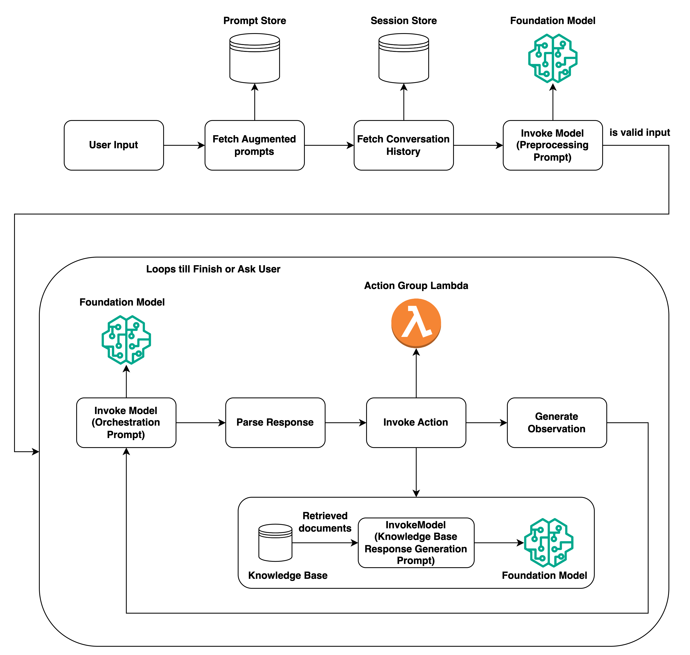

# Agentic AI in AWS

## Introduction

Agentic AI refers to systems where AI models (typically LLMs) are given the autonomy to reason, plan, and execute tasks using tools and external data. In the AWS ecosystem, building these workflows involves a combination of foundation model hosting, orchestration services, and a new suite of specialized tools called **Amazon Bedrock AgentCore**.

## Available AWS Services and Features

### Amazon Bedrock

- **Foundation Models:** Access high-performing models from top AI companies and Amazon through a single API.
- **Model Catalog:** Discover, compare, and choose foundation models from providers like Anthropic, Meta, Mistral, and Amazon.
- **API keys:** Short and long term API keys to access AWS Bedrock API.
- **Playground:** Experiment with different models and configurations in a managed console environment before coding.
- **Tokenizer:** Split prompts into tokens, useful to assess cost per model.
- **Customization:** Fine-tune models with your own data or use continued pre-training for domain-specific tasks.
- **Prompt routers:** Route prompts between models of the same family to improve quality and cost.
- **Knowledge Bases:** Fully managed RAG workflow to connect foundation models to your data for up-to-date responses.
- **Guardrails:** Implement safety controls to filter harmful content and redact sensitive information according to your policies.
- **Model Evaluation:** Compare and evaluate model outputs using built-in or custom datasets with human or automated reviewers.
- **Batch Inference:** Process large datasets efficiently using asynchronous model execution for non-real-time tasks.
- **Prompt Management:** Manage custom prompts for further usage with the models.
- **Agent creation:** See below.

#### Model Catalog

The Bedrock Model Catalog is a unified discovery hub giving access to **100+ foundation models from 17+ providers** through a single API and console — without managing infrastructure.

**Key highlights:**

| Feature | Description |
| --- | --- |
| **Multi-provider access** | Models from Anthropic, Amazon Nova, Meta Llama, Mistral AI, Cohere, Google Gemma, DeepSeek, OpenAI, Stability AI, and more — all through one API. |
| **Modality breadth** | Text, code, image generation, image editing, video, audio (speech), embeddings, and multimodal models. |
| **Model Cards** | Each model includes input/output modalities, context window size, supported APIs, service tiers (Standard, Priority, Flex, Reserved), regional availability, and default quotas (RPM/TPM). |
| **Bedrock Marketplace** | Extends the catalog with 100+ additional specialized models from third-party providers (e.g., IBM Granite, Zendesk models). Models can be subscribed to and deployed on managed endpoints. |
| **On-demand throughput** | All catalog models support on-demand inference with no upfront commitment; provisioned throughput is available for higher, consistent workloads. |
| **Cross-region inference** | Inference profiles (US, EU, APAC, Global) route requests across regions to increase throughput, improve resilience, and satisfy data residency requirements. |
| **Prompt Routers** | Automatically route prompts between models of the same family (e.g., Claude Sonnet ↔ Haiku) to balance quality and cost based on request complexity. |
| **Playground integration** | Browse, compare, and test any catalog model interactively in the console before writing a single line of code. |

**Notable model providers available (as of 2026):**

- **Anthropic** — Claude Opus 4.6, Sonnet 4.6, Haiku 4.5 (and 3.x series)
- **Amazon** — Nova Premier, Nova Pro, Nova Lite, Nova Micro, Nova Sonic (audio), Nova Canvas/Reel (image/video), Titan Embeddings
- **Meta** — Llama 4 Maverick/Scout, Llama 3.x series (1B–405B)
- **Mistral AI** — Mistral Large 3, Magistral, Devstral, Pixtral, Voxtral (audio)
- **Google** — Gemma 3 (4B, 12B, 27B)
- **DeepSeek** — DeepSeek V3, R1
- **Cohere** — Command R+, Embed v4, Rerank 3.5
- **Stability AI** — Stable Image suite (generation, editing, upscaling)
- **TwelveLabs** — Pegasus (video understanding), Marengo (video embeddings)

#### Model Fine-Tuning

Model fine-tuning adapts a pre-trained foundation model to a specific domain, task, or style by updating its weights on your own data. On AWS, fine-tuning is available through two main paths: **Amazon Bedrock** (managed, no infrastructure) and **Amazon SageMaker** (full control, any model/framework).

##### When to Fine-Tune

Fine-tuning is appropriate when prompt engineering and RAG are insufficient — for example, when the model needs to adopt a specific tone or output format, learn domain-specific terminology not present in its training data, or consistently follow complex task structures across many requests.

##### Amazon Bedrock Customization

Bedrock offers three managed customization techniques, all creating a **private copy** of the base model stored in your account. Training data is sourced from S3 and transferred securely through VPC.

| Technique | How It Works | Best For |
| --- | --- | --- |
| **Supervised Fine-Tuning** | Train on labeled input-output pairs (JSONL format). The model learns to associate specific inputs with desired outputs. | Task-specific adaptation (Q&A, classification, summarization) with a labeled golden dataset. |
| **Continued Pre-Training** | Train on large volumes of unlabeled domain text. Updates the model's general knowledge rather than its task behavior. | Domain adaptation (legal, medical, financial) where the model lacks vocabulary or context. |
| **Reinforcement Fine-Tuning** | Define reward functions instead of labeled pairs. The model iterates toward higher-scoring outputs based on feedback. | Alignment tasks where "correct" output is hard to label explicitly (e.g., helpfulness, reasoning quality). |
| **Distillation** | A large "teacher" model generates responses; a smaller "student" model is fine-tuned on them. Automated by Bedrock. | Compressing a capable large model into a faster, cheaper smaller one without manual data labeling. |

**How to start a fine-tuning job in Bedrock (console or SDK):**

1. Prepare your dataset in JSONL format and upload to S3.
2. In the Bedrock console, go to **Foundation models → Custom models → Create fine-tuning job**.
3. Select the base model, point to the S3 training data, configure hyperparameters (epochs, batch size, learning rate), and assign an IAM role.
4. Submit the job. When complete, the custom model appears under **Custom models**.
5. Deploy via **Provisioned Throughput** — custom models require provisioned throughput for inference (on-demand is not available).

```python
import boto3

bedrock = boto3.client("bedrock", region_name="us-east-1")

response = bedrock.create_model_customization_job(
    jobName="my-fine-tuning-job",
    customModelName="my-custom-model",
    roleArn="arn:aws:iam::123456789012:role/BedrockCustomizationRole",
    baseModelIdentifier="amazon.titan-text-express-v1",
    customizationType="FINE_TUNING",
    trainingDataConfig={"s3Uri": "s3://my-bucket/training-data/train.jsonl"},
    outputDataConfig={"s3Uri": "s3://my-bucket/output/"},
    hyperParameters={
        "epochCount": "3",
        "batchSize": "8",
        "learningRate": "0.00005"
    }
)
print(response["jobArn"])
```

##### Amazon SageMaker Fine-Tuning

SageMaker provides full control over the training environment and supports any open-weight model or framework (PyTorch, Hugging Face Transformers, DeepSpeed, etc.).

| Path | Description |
| --- | --- |
| **SageMaker JumpStart** | One-click fine-tuning for curated foundation models (Llama, Mistral, DeepSeek, Stable Diffusion, etc.) with preset hyperparameters. Dataset goes to S3; JumpStart launches the training job automatically. |
| **SageMaker Training Jobs** | Full control: bring your own script, choose instance type (ml.p4d, ml.p5, etc.), configure distributed training (FSDP, DeepSpeed), and manage checkpointing. |
| **SageMaker HyperPod** | For large-scale, long-running fine-tuning of very large models (70B+). Provides resilient distributed training across clusters with automatic node recovery. |

**Typical SageMaker JumpStart fine-tuning flow:**

1. Select a model in **SageMaker Studio → JumpStart → Models**.
2. Choose **Train** and upload your dataset to S3 (format varies by model — Llama expects Alpaca-style JSON).
3. Set hyperparameters (epochs, learning rate, LoRA rank if applicable) and select a training instance.
4. Accept the EULA if required, then submit. The training job runs as a standard SageMaker Training Job.
5. Deploy the fine-tuned model to a **SageMaker Inference Endpoint** or register it in **SageMaker Model Registry** for MLOps governance.

##### Choosing Between Bedrock and SageMaker

| Criteria | Amazon Bedrock | Amazon SageMaker |
| --- | --- | --- |
| Infrastructure management | Fully managed (zero setup) | You manage instances and clusters |
| Supported base models | Bedrock catalog models only | Any open-weight or custom model |
| Fine-tuning techniques | Supervised FT, CPT, RFT, Distillation | Full range (LoRA, QLoRA, FSDP, RLHF, etc.) |
| Inference after fine-tuning | Provisioned Throughput required | Standard SageMaker endpoints (on-demand or provisioned) |
| Best for | Fast, secure fine-tuning with minimal ops | Full customization, large-scale training, open models |

### Amazon Bedrock Agents

[Amazon Bedrock Agents](https://docs.aws.amazon.com/bedrock/latest/userguide/agents.html) is a fully managed capability that makes it easier for developers to create generative AI-based applications that can complete multi-step tasks across company systems and data sources.

- **Reasoning & Planning:** Uses the reasoning capabilities of foundation models (like Anthropic Claude or Amazon Nova) to break down user requests into logical steps.
- **Action Groups:** Connects agents to your systems via AWS Lambda, allowing them to perform actions like processing orders or querying databases.
- **Knowledge Bases:** Integrates Retrieval-Augmented Generation (RAG) to provide agents with access to private company data stored in S3 or vector databases.
- **Flows:** Connect AWS Bedrock assets (prompts, RAGs, agents, Guradrails).



### Amazon Bedrock AgentCore (Preview)

[Amazon Bedrock AgentCore](https://docs.aws.amazon.com/bedrock-agentcore/latest/devguide/what-is-bedrock-agentcore.html) is a platform for building, deploying, and operating agents at scale using any framework (LangGraph, CrewAI, etc.) and model.

- **AgentCore Runtime:** A secure, serverless environment for running agent logic with low-latency cold starts and session isolation.
- **AgentCore Memory:** Provides both short-term (conversation context) and long-term memory that persists across sessions.
- **AgentCore Gateway:** Converts APIs and Lambda functions into [Model Context Protocol (MCP)](https://modelcontextprotocol.io/) compatible tools with minimal code.
- **AgentCore Identity:** Manages secure agent-to-service authentication, compatible with providers like Okta or Cognito.
- **AgentCore Policy:** A policy engine is a collection of policies that evaluates and authorizes agent tool calls. When associated with a gateway, the policy engine intercepts all agent requests and determines whether to allow or deny each action based on the defined policies.
- **Code Interpreter & Browser:** Isolated environments for agents to execute generated code (Python/JS) or interact with web applications.

### Orchestration & Integration

- **AWS Step Functions:** Used for complex, long-running agentic workflows that require human-in-the-loop or stateful orchestration.
- **Amazon EventBridge:** Facilitates decoupled communication between multiple specialized agents (Multi-agent systems).
- **Amazon CloudWatch & X-Ray:** Essential for monitoring agent trajectories, debugging failures, and observing latency.

## Model and Agent Evaluation

Implementing production-grade AI agents requires moving "beyond vibes" toward systematic, quantitative evaluation. AWS provides specialized tools for evaluating both the underlying foundation models and the end-to-end agentic workflows.

### 1. Amazon Bedrock Model Evaluation

[Amazon Bedrock Evaluations](https://docs.aws.amazon.com/bedrock/latest/userguide/evaluation.html) allows you to assess foundation models and Retrieval-Augmented Generation (RAG) systems before and during development.

- **Automatic Evaluation:** Uses predefined metrics like accuracy, toxicity, and robustness with curated or custom datasets.
- **LLM-as-a-Judge:** Leverages a separate high-capability model (e.g., Claude 3.5 Sonnet) to evaluate the generator model's responses for complex dimensions like correctness, completeness, and brand voice alignment.
- **Human Evaluation:** Integrates human reviewers—either your own team or through AWS Managed Workers—to assess subjective qualities like style and relevance.
- **RAG Evaluation:** Specifically measures the retrieval and generation components of your Knowledge Bases to ensure they provide relevant, factual information.

### 2. Amazon Bedrock AgentCore Evaluations (Preview)

[AgentCore Evaluations](https://docs.aws.amazon.com/bedrock-agentcore/latest/devguide/evaluations.html) is purpose-built for assessing the **dynamic, multi-step behavior of agents** in real-world scenarios. Unlike standard Bedrock Model Evaluation (which scores static prompt-response pairs), AgentCore Evaluations reads live **OpenTelemetry spans** produced by your agent and evaluates entire sessions, individual traces, or specific tool calls.

#### How It Differs from Standard Bedrock Model Evaluation

| Dimension | Bedrock Model Evaluation | AgentCore Evaluations |
| --- | --- | --- |
| Target | Foundation model outputs | Multi-step, tool-using agents |
| Input | Static datasets | Live OTel spans from production |
| Mode | Batch / one-off | Continuous online + targeted on-demand |
| Granularity | Single prompt-response | Session → Trace → Tool Call |
| Ground truth | Often required | Reference-free (LLM-as-judge) |
| Framework support | Any | LangGraph, Strands Agents, CrewAI |

#### Enabling AgentCore Evaluations

1. **Enable CloudWatch Transaction Search** in your AWS account (required for span storage).
2. **Add OTEL instrumentation** to your agent — install `aws-opentelemetry-distro` and configure the exporter:

   ```bash
   pip install aws-opentelemetry-distro
   ```

   ```python
   # For agents outside AgentCore Runtime, set the service name attribute
   import os
   os.environ["OTEL_RESOURCE_ATTRIBUTES"] = "service.name=<agent-name>.<endpoint-name>"
   ```

3. **Configure IAM** — attach `BedrockAgentCoreFullAccess` (or a scoped policy) and create a service execution role trusted by `bedrock-agentcore.amazonaws.com` with CloudWatch read/write and Bedrock `InvokeModel` permissions.

4. **Create an evaluation configuration** via the AgentCore console (**Bedrock AgentCore → Evaluation**) or the API (see below).

#### Evaluation Modes

**Online Evaluation** — a persistent, asynchronous job that continuously samples live sessions from CloudWatch, scores them through LLM judges, and writes results back to CloudWatch.

```python
import boto3

client = boto3.client("bedrock-agentcore", region_name="us-east-1")

response = client.create_online_evaluation_config(
    name="production-agent-eval",
    executionRoleArn="arn:aws:iam::123456789012:role/AgentCoreEvalRole",
    dataSourceConfig={
        "cloudWatchConfig": {
            "logGroups": [{"logGroupName": "aws/spans"}],
            "serviceName": "my-agent.prod-endpoint"
        }
    },
    evaluators=[
        {"evaluatorId": "Builtin.GoalSuccessRate"},
        {"evaluatorId": "Builtin.ToolSelectionAccuracy"},
        {"evaluatorId": "Builtin.Helpfulness"},
    ],
    samplingConfig={"samplingPercentage": 10.0},  # Sample 10% of live sessions
    enableOnCreate=True
)
```

**On-Demand Evaluation** — a one-shot call targeting specific spans. Useful for post-incident analysis or testing a logic change against known traces.

```python
# Target a specific trace by ID
response = client.evaluate(
    evaluationConfigId="<config-id>",
    sessionSpans=[...],  # Raw spans downloaded from CloudWatch
    evaluationTarget={"traceIds": ["<trace-id>"]}
)
```

You can target at three granularities:

- **Session-level:** full session (all traces)
- **Trace-level:** specific `traceIds`
- **Tool-level:** specific `spanIds` (individual tool calls)

#### Built-in Evaluators (LLM-as-Judge)

AWS provides 14 built-in, reference-free evaluators. All use an internal judge model — no ground truth is required.

| Evaluator ID | Level | What It Measures |
| --- | --- | --- |
| `Builtin.GoalSuccessRate` | Session | Did the agent achieve all user goals? |
| `Builtin.Coherence` | Trace | Logical consistency of the response |
| `Builtin.Conciseness` | Trace | Minimal verbosity without losing information |
| `Builtin.ContextRelevance` | Trace | Relevance to retrieved context |
| `Builtin.Correctness` | Trace | Factual accuracy |
| `Builtin.Faithfulness` | Trace | Grounded in retrieved context (hallucination) |
| `Builtin.Harmfulness` | Trace | Harmful or unsafe content detection |
| `Builtin.Helpfulness` | Trace | Overall usefulness to the user |
| `Builtin.InstructionFollowing` | Trace | Adherence to system prompt instructions |
| `Builtin.Refusal` | Trace | Appropriate refusal of out-of-scope requests |
| `Builtin.ResponseRelevance` | Trace | Relevance of the response to the user query |
| `Builtin.Stereotyping` | Trace | Bias and stereotyping detection |
| `Builtin.ToolParameterAccuracy` | Tool Call | Correctness of parameter values passed to a tool |
| `Builtin.ToolSelectionAccuracy` | Tool Call | Whether the right tool was selected for the task |

You can also define **custom evaluators** using any Bedrock-hosted foundation model as judge, with a custom prompt, scoring scale, and evaluation level (`SESSION`, `TRACE`, or `TOOL_CALL`).

#### Viewing Results

Evaluation results are available in three places:

- **CloudWatch Logs** — `/aws/bedrock-agentcore/evaluations/results/<config-id>` (JSON, with original `traceId`/`sessionId` references)
- **CloudWatch Metrics** — namespace `Bedrock-AgentCore/Evaluations`, filterable by evaluator and score label
- **AgentCore / CloudWatch GenAI Observability console** — visual dashboards under **CloudWatch → GenAI Observability → Bedrock AgentCore → [Agent] → Evaluations**

### Recommendations for Evaluation Practices

1. **Define a "Golden Set":** Create a high-quality dataset of user prompts and expected outcomes (Ground Truth) to maintain a consistent benchmark across different model versions or prompt iterations.
2. **Implement Continuous Monitoring:** Use Online Evaluation to detect distribution shifts or performance regressions in real-time interactions, not just at the time of deployment.
3. **Multi-Dimensional Metrics:** Don't rely on a single score. Evaluate agents across multiple "dimensions":
    - **Correctness:** Is the information factually accurate?
    - **Helpfulness:** Did the agent fulfill the user's intent?
    - **Groundedness:** Does the response strictly follow the retrieved facts from the Knowledge Base?
    - **Latency:** Is the agent's multi-step reasoning process within acceptable performance limits?
4. **Iterative Refinement:** Treat evaluation as a loop. Use low-scoring traces from AgentCore Observability to identify edge cases, refine agent prompts, and update the "Golden Set."

## Best Practices and Recommendations

1. **Start with Small, Specialized Agents:** Instead of a single "do-everything" agent, use a supervisor-worker pattern where specialized agents handle specific domains (e.g., a "Sales Agent" and a "Support Agent").
2. **Implement Guardrails:** Use [Amazon Bedrock Guardrails](https://docs.aws.amazon.com/bedrock/latest/userguide/guardrails.html) to filter harmful content, mask PII, and ensure agents stay within defined business boundaries.
3. **Trace and Audit Trajectories:** Use AgentCore Observability to inspect the step-by-step reasoning of your agent. This is critical for debugging "hallucinations" or logical errors in the agent's plan.
4. **Use MCP for Tooling:** Standardize tool integration using the Model Context Protocol via AgentCore Gateway to make your backend services interoperable across different agent frameworks and models.
5. **Human-in-the-Loop (HITL):** For high-stakes actions (like executing a financial transaction), integrate approval steps using AWS Step Functions or Amazon Bedrock's built-in confirmation mechanisms.

## Use Cases

### Case 1: Autonomous Customer Service Assistant

An agent that doesn't just answer questions but acts on them. It can access a **Knowledge Base** to answer policy questions and use **Action Groups** to trigger a return shipment or update a customer's address in the CRM.

### Case 2: Multi-Agent Software Modernization

A group of specialized agents orchestrated via **CrewAI** or **AgentCore**:

- **Architect Agent:** Analyzes legacy code and designs the new structure.
- **Developer Agent:** Uses the **Code Interpreter** to refactor specific modules.
- **Security Agent:** Scans the new code for vulnerabilities before deployment.

### Case 3: Personalized Financial Advisor

A stateful agent using **AgentCore Memory** to remember user preferences and past financial goals. It uses the **Browser tool** to research current market trends and combines this with internal portfolio data via **Knowledge Bases** to provide personalized investment recommendations.

## References

- [Amazon Bedrock AgentCore Documentation](https://docs.aws.amazon.com/bedrock-agentcore/latest/devguide/what-is-bedrock-agentcore.html)
- [Designing Agentic Workflows on AWS - Prescriptive Guidance](https://docs.aws.amazon.com/prescriptive-guidance/latest/agentic-ai-patterns/designing-agentic-workflows-on-aws.html)
- [Introducing Amazon Bedrock AgentCore - AWS News Blog](https://aws.amazon.com/blogs/aws/introducing-amazon-bedrock-agentcore-securely-deploy-and-operate-ai-agents-at-any-scale/)
- [Building crypto AI agents on Amazon Bedrock - AWS Web3 Blog](https://aws.amazon.com/blogs/web3/build-crypto-ai-agents-on-amazon-bedrock/)

