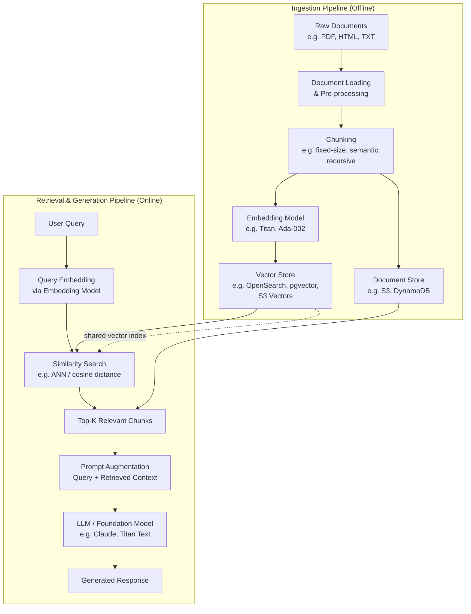
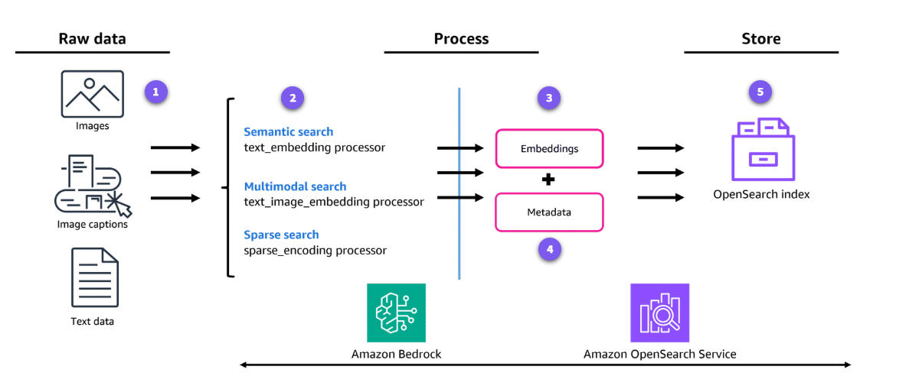
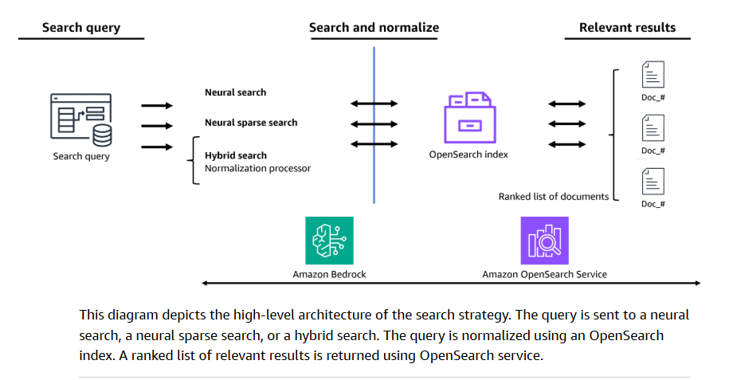
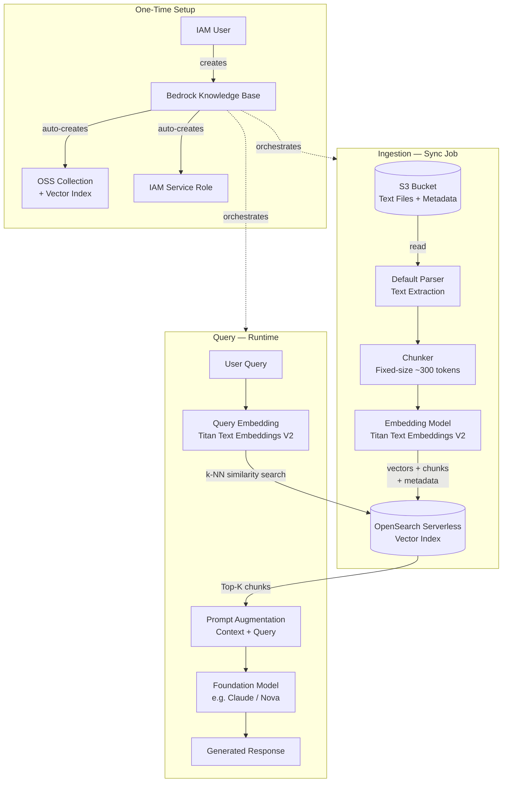
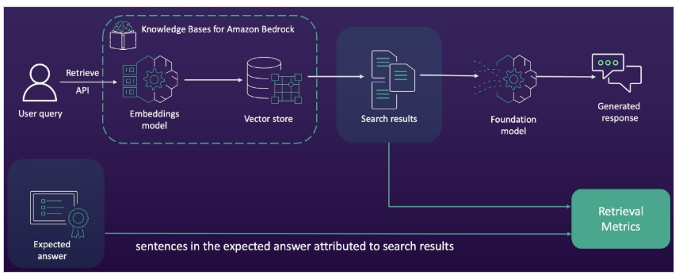
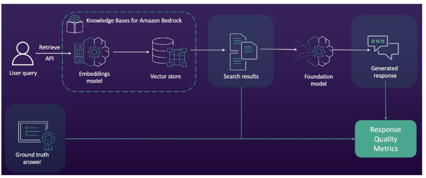

# AWS RAG Application Development

Retrieval-Augmented Generation (RAG) is an architectural pattern that enhances foundation model responses by grounding them in external, domain-specific data. This prevents hallucinations and provides up-to-date information without the need for constant model fine-tuning.

## RAG Pipeline

### Parsing Methods (preprocessing)

- **Amazon Bedrock default parser** - For text only. No additional charges applied.
- **Amazon Bedrock Data Automation** - Multimodal support, fully managed processed, pay per page.
- **Foundation models** - Multimodal support, custom prompts, pay per tokens.

> [!NOTE]
> Lambda functions can also be used to customize the logic to ingest the data into the KBs.

### Chunk Considerations

Chunk size is a trade-off between **context richness** and **retrieval precision**. Larger chunks preserve more surrounding context but introduce noise and may exceed model token limits. Smaller chunks improve retrieval accuracy but can lose the surrounding context needed to generate a coherent answer. Key factors to consider:

- **Document type:** Structured docs (tables, code) benefit from smaller, logical chunks; narrative prose tolerates larger ones.
- **Embedding model token limit:** Most models cap at 512–8192 tokens — chunks must fit within this window.
- **LLM context window:** The sum of retrieved chunks + prompt must fit in the generator's context window.
- **Query nature:** Short, precise queries favor small chunks; broad, conceptual queries favor larger ones.

#### Chunking Methods

| Method | Description | Best For |
| --- | --- | --- |
| **Fixed-size** | Splits text into chunks of N tokens/characters, optionally with overlap. Simple and fast. | Large homogeneous corpora where document structure is irrelevant. |
| **Recursive / Structure-aware** | Splits on a hierarchy of separators (paragraph → sentence → word) to respect natural boundaries. | General-purpose use; default strategy in LangChain. |
| **Semantic** | Uses an embedding model to detect topic shifts and groups sentences by meaning into variable-size chunks. | Documents with varying section lengths where topic coherence matters most. |
| **Hierarchical (parent-child)** | Stores small child chunks for precise retrieval but returns the larger parent chunk to the LLM for context. | Balancing retrieval precision with generation quality. |

### Vector Generation

Some relevant concepts are:

- **Vector models**: A vector space model or term vector model is an algebraic model for representing text documents or items as vectors. With vector models, the distance between vectors represents the relevance between the documents. The chunks of documents are encoded to vectors which can retrieve similar vectors using a distance calculation.
- **Vector embeddings**: A vector embedding is an array of numbers that represent the chunks of data. Machine learning (ML) embedding models are used to encode the meaning and context of documents, images, and audio into vectors for similarity search.
- **Embedding models**: Embedding models are algorithms that are trained to encapsulate information into dense representations in a multidimensional space.
- **Engines or algorithms**: The engine or algorithm is the approximate k-nearest neighbors (k-NN) library to use for indexing and search. The available libraries in Amazon OpenSearch are Facebook AI Similarity Search (FAISS) and Apache Lucene.
- **Methods**: A method definition refers to the underlying configuration of the approximate k-NN algorithm you want to use. One available value is Hierarchical Navigable Small Worlds (HNSW), which is a hierarchical proximity graph approach to an approximate a k-NN search. Another available value is the Inverted File System (IVF), which is a bucketing approach where vectors are assigned different buckets based on clustering. During a search, only a subset of the buckets is searched.
- **Space type or similarity metric**: The space type or similarity metric is the vector space used to calculate the distance between vectors. The supported similarity metrics are Euclidean distance, Manhattan distance, and Cosine similarity.

> [!NOTE]
> Vector embeddings can be generated using an AWS Bedrock embedding model or the neural search pipeline service withing OpenSearch.

### Search in OpenSearch

**Lexical search (BM25)** is the classic full-text search in OpenSearch, ranking documents by term frequency and inverse document frequency; it excels at exact keyword matching but fails on synonyms or paraphrased queries.

**Vector / k-NN search** converts both the query and stored documents into dense embeddings and retrieves the top-K nearest neighbors by cosine similarity or Euclidean distance using an ANN index (HNSW or IVF via FAISS/Lucene); it captures semantic meaning but ignores exact term overlap.

**Hybrid search** combines a BM25 lexical query with a k-NN vector query in a single request, then merges their score lists using a normalization processor (e.g., min-max or L2) and a combination technique (e.g., arithmetic mean or reciprocal rank fusion); this delivers both keyword precision and semantic recall, making it the recommended strategy for most RAG workloads.

**Sparse vector search (neural sparse)** uses a learned sparse encoder (such as Amazon's own model available in Bedrock) to produce a high-dimensional sparse vector of weighted tokens, which is stored and queried like an inverted index; it bridges the gap between lexical and dense approaches, offering strong out-of-the-box performance with lower memory overhead than dense k-NN indexes.

## Vector Store Options in AWS

AWS offers a variety of services to store and query vector embeddings, ranging from fully managed serverless options to specialized database engines.

### 1. Amazon OpenSearch Serverless (Vector Engine)

A serverless option for Amazon OpenSearch Service that simplifies the deployment of vector search workloads.

- **Best For:** High-scale, production-grade applications requiring full-text search combined with vector search.
- **Key Feature:** Automatic scaling of compute and storage resources without managing clusters.

### 2. Amazon Aurora PostgreSQL (with pgvector)

Adds vector similarity search capabilities to the high-performance Aurora relational database.

- **Best For:** Teams already using PostgreSQL who want to store both relational data and vector embeddings in the same database.
- **Key Feature:** Supports exact and approximate nearest neighbor (ANN) search using HNSW and IVFFlat indexes.

### 3. Amazon S3 Vectors

A new cost-effective way to store and search vector embeddings directly in Amazon S3.

- **Best For:** Applications where storage cost is a primary concern and latency requirements are flexible.
- **Key Feature:** Native integration with Amazon Bedrock Knowledge Bases for simplified RAG pipelines.

### 4. Amazon Neptune Analytics

A memory-optimized engine that combines graph database analytics with vector search.

- **Best For:** Use cases requiring relationship-heavy data (e.g., fraud detection, knowledge graphs) combined with semantic search.
- **Key Feature:** Allows vector search within complex graph traversals.

### 5. Other specialized options

- **Amazon MemoryDB:** For ultra-low latency, in-memory vector search.
- **Amazon DocumentDB:** For JSON-focused workloads with vector search capabilities.
- **Third-Party (AWS Marketplace):** Managed Pinecone, MongoDB Atlas, or Weaviate.

---

## RAG Implementation Paths on AWS

There are two primary paths to implementing RAG on AWS, depending on the level of control and management required.

### Path A: Managed RAG (Amazon Bedrock Knowledge Bases)

The most streamlined approach, where AWS manages the orchestration of the RAG lifecycle.

- **Workflow:** You point to an S3 bucket with your documents, and the service handles chunking, embedding generation, ingestion into a vector store, and the retrieval/generation loop.
- **Ideal For:** Rapid development, proof-of-concepts, and production apps where AWS-managed defaults meet the requirements.
- **Supported Stores:** OpenSearch Serverless, Aurora (pgvector), Pinecone, and S3 Vectors.

### Path B: Custom RAG (Orchestrated Architecture)

A "build-your-own" approach using individual AWS services, often orchestrated by frameworks like **LangChain**, **LlamaIndex**, or **AWS Step Functions**.

- **Workflow:**
    1. **Data Ingestion:** Large documents are processed (e.g., via AWS Glue or Lambda) and chunked.
    2. **Embedding:** Chunks are sent to a Bedrock embedding model (e.g., Titan Text Embeddings).
    3. **Storage:** Chunks and embeddings are stored in a chosen vector store (e.g., self-managed OpenSearch).
    4. **Retrieval:** A user query is embedded and used to perform a similarity search.
    5. **Augmentation:** The retrieved context is formatted into a prompt for the generator model.
- **Ideal For:** Advanced use cases requiring custom chunking strategies, complex pre-processing, hybrid search (keyword + vector), or integration with external (non-AWS) systems.

## Use Cases

### RAG Workflow with OpenSearch Serverless

Key components:

- **Data Source** - S3 buckets with source files. Use **parsing method** (default for text or multimodal with LLM/Data Automation).
- **Metadata** - JSON details added beside to each file and included as part of the ingestion.
- **Chunking strategy** - fixed, hierarchical, semantic, etc. See [chunking methods](#chunking-methods).
- **Vectorization** using an embedding model (e.g. AWS Titan).
- **Store in vector store**, using OpenSearch Serverless.
- **Vector index** either automatically created by AWS Bedrock in the selected vector store or explicitily created.
- **Retrieval** - default (Bedrock chooses), hybrid (text and vector searches) and semantic (only vector searches). API supports *RetrieveAndGenerate* (retrieve from KB and send to LLM and returned final output) and *Retrieve* (get only KB output).

#### Step-by-Step Implementation

> **Prerequisites:** An IAM user (not root) with Bedrock permissions; model access enabled for the chosen embedding model (e.g. *Amazon Titan Text Embeddings V2*) and generator model in the AWS Console.

##### Step 1 — Prepare the S3 data source

Upload your text files to an S3 bucket. Optionally place a sidecar `<filename>.metadata.json` next to each file to attach filterable metadata (author, date, category, etc.) that Bedrock will index alongside the vector. Keep source files and metadata in the same prefix.

##### Step 2 — Open the Knowledge Bases console

In the Amazon Bedrock console, navigate to **Knowledge bases → Create → Knowledge base with vector store**. Give the KB a name and description.

##### Step 3 — Configure the IAM service role

Choose *Create and use a new service role*. Bedrock automatically generates a role with the minimum permissions required: read access to your S3 bucket, invocation rights on the selected embedding model, and write access to the OpenSearch Serverless collection it will create.

##### Step 4 — Connect the S3 data source

Select **Amazon S3** as the data source type, then specify the bucket (and optional prefix). For text-only files, keep the **parsing strategy** set to *Amazon Bedrock default parser* — no extra cost, no multimodal processing needed.

##### Step 5 — Choose the chunking strategy

Select a [chunking method](#chunking_methods). For a first deployment with plain text, *Default chunking* (fixed-size, ~300 tokens with 20% overlap) is a solid baseline. Adjust chunk size based on average document length and your LLM's context window.

##### Step 6 — Select the embedding model

Pick an embeddings model — *Amazon Titan Text Embeddings V2* (1536 dimensions) is the default and a reliable choice. Optionally switch to *float32* vs *binary* embeddings under Additional configurations to trade precision for cost.

##### Step 7 — Create the vector store (Quick create)

Under **Vector database**, choose *Quick create a new vector store → Amazon OpenSearch Serverless*. Bedrock automatically provisions an OpenSearch Serverless *vector search* collection, creates the required index with the correct field mappings (`bedrock-knowledge-base-default-index`, fields: `bedrock-knowledge-base-default-vector`, `AMAZON_BEDROCK_TEXT_CHUNK`, `AMAZON_BEDROCK_METADATA`), and wires the IAM permissions.

> **Note:** If a pre-existing collection is required, use *Choose a vector store you have created* and manually map the field names. The collection must use the **vector search** type (not *time-series* or *search*).

##### Step 8 — Review and create

Review all settings, then click **Create knowledge base**. Status transitions from *Creating* → *Ready*. The OpenSearch Serverless collection and index are visible in the OpenSearch console once provisioning completes.

##### Step 9 — Sync the data source

From the KB detail page, select the data source and click **Sync**. Bedrock reads every file from S3, parses and chunks the text, calls the embedding model to generate vectors, and writes chunks + embeddings + metadata into the OpenSearch index. Sync status progresses from *In progress* → *Complete*.

##### Step 10 — Test retrieval

Use the built-in **Test knowledge base** panel to run natural-language queries. Verify that returned chunks are relevant and that the source attribution (S3 URI) is correct. For programmatic access, use the Bedrock Agent Runtime API:

- `RetrieveAndGenerate` — retrieves relevant chunks and passes them to an LLM in a single call, returning the final generated answer.
- `Retrieve` — returns only the raw chunks (with scores and metadata), useful when you want to build your own prompt or post-process results.

##### Step 11 — Re-sync on content updates

Whenever files are added, modified, or deleted in S3, trigger a new sync (manually via console, via the `StartIngestionJob` API, or on a schedule via EventBridge). Only changed files are re-processed (incremental sync).

#### Architecture Diagram

## Knowledge Base Testing

AWS recommends evaluating a Knowledge Base in two independent stages — **retrieval** and **generation** — since each has distinct failure modes and metrics. The built-in evaluation framework is accessible from the Amazon Bedrock console under **Evaluations → Knowledge Bases**.

### 1. Console smoke test (Retrieve & RetrieveAndGenerate)

The quickest first check: use the **Test knowledge base** panel in the Bedrock console to issue natural-language queries immediately after sync. Verify that the returned chunks are topically relevant, that source URIs point to the expected S3 objects, and that the generated answer is factually grounded in the retrieved context. This catches obvious indexing failures and misconfigured chunking before investing in a formal evaluation.

### 2. Retrieval evaluation (context relevance & coverage)

Evaluate the retrieval stage in isolation using the `Retrieve` API and a JSONL test dataset (up to 1,000 prompts). Bedrock computes two metrics automatically:

- **Context relevance** — measures *precision*: whether each retrieved chunk directly addresses the query intent, avoiding noisy or off-topic passages.
- **Context coverage** — measures *recall*: how completely the retrieved chunks cover the expected ground-truth answer; requires a reference answer per prompt.

Fixing retrieval issues first is recommended because poor retrieval propagates errors into every downstream metric.

### 3. Generation evaluation (LLM-as-a-Judge)

Once retrieval quality is acceptable, run an end-to-end `RetrieveAndGenerate` evaluation. Bedrock scores responses across eight metrics using a judge model (but a test dataset is needed for comparison):

| Category | Metrics |
| --- | --- |
| **Response quality** | Helpfulness, Correctness, Logical coherence, Completeness, Faithfulness (hallucination resistance) |
| **Responsible AI** | Harmfulness, Stereotyping, Refusal (appropriate decline of out-of-scope queries) |

Results include aggregate scores and per-prompt conversation samples — review low-scoring conversations qualitatively to identify root causes.

### 4. Building a test dataset

A representative test dataset is the foundation of meaningful evaluation. Three approaches are recommended:

- **Human annotation** — domain experts write question-answer pairs against the actual source documents; highest quality but time-consuming. Tools: Amazon SageMaker Ground Truth, Amazon Mechanical Turk.
- **Synthetic generation (LLM-assisted)** — use a foundation model to auto-generate Q&A pairs from the document corpus (*self-instruct* or *knowledge distillation* approaches). Faster and cheaper; requires minimal human spot-check validation.
- **Feedback loop** — capture real user queries and flagged low-quality responses in production, review them periodically, and incorporate them into the test set. Turns evaluation into a continuously improving, living dataset rather than a one-time artefact.

Strive for dataset coverage that spans the full range of queries real users will ask, including edge cases and out-of-scope questions to test refusal behaviour.

### 5. Metadata filtering validation

If metadata is attached to source documents (e.g. `department`, `date`, `classification`), validate that filtered queries return only documents matching the filter and that unfiltered queries are not artificially narrowed. Use the `Retrieve` API with an explicit `filter` object and assert the returned `location` and `metadata` fields.

### 6. Re-ranking validation

When a re-ranking model is enabled (e.g. Amazon Bedrock's default re-ranker or a custom model), compare Top-K results before and after re-ranking on your test set to confirm that context relevance scores improve and that the most pertinent chunk is consistently ranked first.

### 7. Iterative configuration tuning

If evaluation scores fall below acceptable thresholds, adjust one variable at a time and re-evaluate:

- **Low context coverage** → increase chunk size or Top-K, or switch to hierarchical chunking.
- **Low context relevance** → decrease chunk size, switch to semantic chunking, or enable hybrid search.
- **Low faithfulness** → tighten the system prompt to instruct the model to answer only from retrieved context.
- **Low completeness** → increase Top-K or broaden the retrieval strategy.

> **Reference:** [Evaluate and improve performance of Amazon Bedrock Knowledge Bases](https://aws.amazon.com/blogs/machine-learning/evaluate-and-improve-performance-of-amazon-bedrock-knowledge-bases/) — AWS ML Blog, March 2025.

## References

- [Vector Database Options - AWS Prescriptive Guidance](https://docs.aws.amazon.com/prescriptive-guidance/latest/choosing-an-aws-vector-database-for-rag-use-cases/vector-db-options.html)
- [Using S3 Vectors with Amazon Bedrock - S3 User Guide](https://docs.aws.amazon.com/AmazonS3/latest/userguide/s3-vectors-bedrock-kb.html)
- [Amazon Bedrock Knowledge Bases Documentation](https://docs.aws.amazon.com/bedrock/latest/userguide/knowledge-bases.html)
- [Udemy video - Knowledge Base creation with OpenSearch](https://cognizant.udemy.com/course/aws-certified-machine-learning-engineer-associate-mla-c01/learn/lecture/45286391)
- 