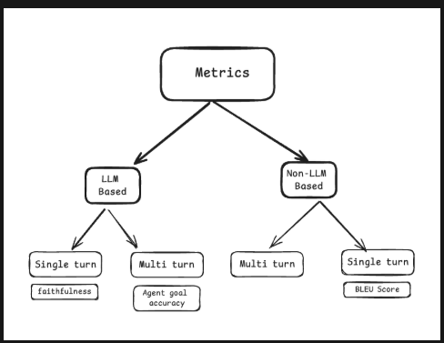

# Ragas: Evaluation Framework for RAG and LLM Applications

**Ragas** (Retrieval-Augmented Generation Assessment) is an open-source framework (latest version 0.4.3) designed to help you evaluate your Retrieval-Augmented Generation (RAG) pipelines and LLM applications. It provides a suite of metrics to measure the performance of both the retrieval and generation components of your system.

## Core Concepts

### Datasets

A **Dataset** in Ragas is a structured collection of test data that serves as the foundation for evaluating AI systems. It contains:

- **Inputs** — the core component; a set of inputs the system will process (e.g., queries in a RAG pipeline).
- **Expected Outputs** *(optional)* — ground truth responses used for comparison and validation.
- **Metadata** *(optional)* — additional information used to slice and analyze performance across different facets.

Ragas provides three key data structures: `EvaluationDataset` (the main collection class), `SingleTurnSample` (for single-turn interactions), and `MultiTurnSample` (for multi-turn conversations). Datasets can be stored locally as CSV files or in cloud storage, and support versioning through naming conventions.

### Experiments

An **Experiment** in Ragas is a deliberate change made to your application to test a hypothesis. It provides a systematic way to measure how modifications impact system performance through quantifiable metrics.

Every experiment is built around three elements:

1. **Test dataset** — the data used for evaluation.
2. **Application endpoint** — the system or component being tested.
3. **Metrics** — quantitative measures assessing performance.

Experiments follow a repeating cycle: **make a change → run evaluations → observe results → hypothesize next change → repeat**. Ragas provides an `@experiment` decorator to streamline implementation, handling the setup, run, evaluate, and store phases with minimal boilerplate.

## Main Features

- **Component-Level Metrics:** Specialized metrics for evaluating different parts of the RAG pipeline.
  - **Faithfulness:** Measures if the answer is derived solely from the retrieved context (no hallucinations).
  - **Answer Relevancy:** Measures how relevant the answer is to the initial query.
  - **Context Precision:** Measures if the retrieved context contains all the necessary information to answer the question.
  - **Context Recall:** Measures the overlap between the retrieved context and the ground truth.
- **LLM-as-a-Judge:** Uses high-capability models to perform automated scoring, reducing the need for expensive human evaluation.
- **Integration with AWS Bedrock:** Easily evaluate models hosted on Amazon Bedrock by configuring them as the evaluator (judge) or generator.
- **Synthetic Test Data Generation:** Capability to generate test datasets consisting of questions and ground truths to benchmark your system.
- **Framework Agnostic:** Works seamlessly with popular orchestration frameworks like LangChain and LlamaIndex.

## Types of Metrics in Ragas

Ragas classifies its metrics using two distinct organizational systems.



### By Mechanism

- **LLM-based metrics** employ language models for evaluation, potentially involving multiple LLM calls. They inherit from `MetricWithLLM`, are closer to human evaluation, and support customizable prompts for domain-specific adaptation. However, they may be non-deterministic.
- **Non-LLM-based metrics** operate without language models, inheriting from the base `Metric` class. They are deterministic and rely on traditional methods like string similarity or BLEU scoring, but show lower correlation with human evaluation.

### By Interaction Type

- **Single-turn metrics** evaluate individual user-AI exchanges. They use the `SingleTurnMetric` class with `single_turn_ascore` and `SingleTurnSample` objects.
- **Multi-turn metrics** assess multiple interaction rounds. They use the `MultiTurnMetric` class with `multi_turn_ascore` and `MultiTurnSample` objects.

### By Output Type

- **Discrete metrics** return values from a predefined list of categorical classes without inherent ordering (e.g., pass/fail).
- **Numeric metrics** produce integer or float values within a specified range, supporting statistical aggregation.
- **Ranking metrics** compare multiple outputs simultaneously and return a ranked list based on a defined criterion.

## How to Use Ragas

To use Ragas effectively, you typically follow these steps:

1. **Prepare your Data:** You need a dataset containing `questions`, `contexts` (retrieved documents), and `answers` (LLM-generated).
2. **Select Metrics:** Choose the metrics that align with your evaluation goals (e.g., faithfulness for hallucination detection).
3. **Configure the Evaluator LLM:** Define which model will act as the "judge" (e.g., Anthropic Claude 3.5 Sonnet on Bedrock).
4. **Run Evaluation:** Compute the scores and analyze the results.

### Basic Example (Python)

Below is a simple example showing how to evaluate a small set of results using Ragas with Amazon Bedrock via LangChain integration.

```python
from ragas import evaluate
from ragas.metrics import faithfulness, answer_relevancy
from datasets import Dataset
from langchain_aws import ChatBedrock

# 1. Define your evaluation LLM (Judge)
evaluator_llm = ChatBedrock(
    model_id="anthropic.claude-3-5-sonnet-20240620-v1:0",
    region_name="us-east-1"
)

# 2. Prepare your data
data_samples = {
    'question': ['When was the first iPhone released?'],
    'answer': ['The first iPhone was released on June 29, 2007.'],
    'contexts': [['Apple Inc. released the first iPhone on June 29, 2007.']],
}
dataset = Dataset.from_dict(data_samples)

# 3. Run evaluation
score = evaluate(
    dataset,
    metrics=[faithfulness, answer_relevancy],
    llm=evaluator_llm
)

print(score.to_pandas())
```

### RAG Evaluation Example (Python)

This example from the [official Ragas tutorial](https://docs.ragas.io/en/stable/tutorials/rag/) shows a full RAG evaluation workflow using the `@experiment` decorator, a custom `DiscreteMetric`, and a CSV-backed dataset.

#### Step 1 — Create the test dataset

```python
import pandas as pd

samples = [
    {"query": "What is Ragas 0.3?", "grading_notes": "- Ragas 0.3 is a library for evaluating LLM applications."},
    {"query": "How to install Ragas?", "grading_notes": "- install from source  - install from pip using ragas[examples]"},
    {"query": "What are the main features of Ragas?", "grading_notes": "organised around - experiments - datasets - metrics."}
]

pd.DataFrame(samples).to_csv("datasets/test_dataset.csv", index=False)
```

#### Step 2 — Define a custom evaluation metric

```python
from ragas.metrics import DiscreteMetric

my_metric = DiscreteMetric(
    name="correctness",
    prompt="Check if the response contains points mentioned from the grading notes and return 'pass' or 'fail'.\nResponse: {response} Grading Notes: {grading_notes}",
    allowed_values=["pass", "fail"],
)
```

#### Step 3 — Run the experiment

```python
from ragas import experiment

@experiment()
async def run_experiment(row):
    response = rag_client.query(row["query"])

    score = my_metric.score(
        llm=llm,
        response=response.get("answer", " "),
        grading_notes=row["grading_notes"]
    )

    return {
        **row,
        "response": response.get("answer", ""),
        "score": score.value,
        "log_file": response.get("logs", " "),
    }
```

The `@experiment` decorator handles the evaluation loop over the dataset, applies the metric to each row, and stores results (e.g., to a CSV) for later comparison.

## References

- [Ragas Documentation (PyPI)](https://pypi.org/project/ragas/)
- [Evaluate RAG responses with Amazon Bedrock and RAGAS (AWS Blog)](https://aws.amazon.com/blogs/machine-learning/evaluate-rag-responses-with-amazon-bedrock-llamaindex-and-ragas/)
- [Evaluate Bedrock Agents with Ragas and LLM-as-a-judge (AWS Blog)](https://aws.amazon.com/blogs/machine-learning/evaluate-amazon-bedrock-agents-with-ragas-and-llm-as-a-judge/)
