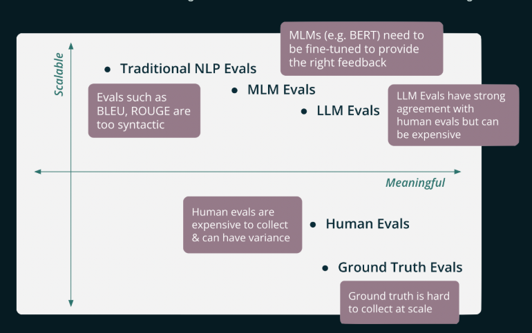

# TruLens

## What is TruLens?

TruLens is an **open-source evaluation and tracing platform for AI agents and LLM applications**. It helps developers ship agentic workflows to production faster by providing objective, scalable measurement of AI quality. Originally developed by TruEra (now acquired by Snowflake), it supports LangChain, LlamaIndex, NeMo Guardrails, and custom implementations.

---

## Main Components

| Component | Description |
| --- | --- |
| **Feedback Functions** | Programmatic evaluation methods that wrap provider models to score app outputs. Support LLMs, BERT-style models, and traditional NLP metrics. |
| **RAG Triad** | Three-metric framework to detect hallucinations in Retrieval-Augmented Generation systems. |
| **Tracing & Observability** | OpenTelemetry-compatible tracing that integrates with existing observability stacks. Records `Spans` and `Records` across every component call. |
| **TruLens Dashboard** | Visual interface for comparing app versions, inspecting traces, and surfacing regressions. |

---

## Use Cases

### 1. RAG Pipeline Evaluation

Evaluate whether a retrieval-augmented chatbot is grounded, relevant, and hallucination-free.

1. Instrument your RAG app with `TruChain` (LangChain) or `TruLlama` (LlamaIndex).
2. Define feedback functions for the **RAG Triad**: context relevance, groundedness, answer relevance.
3. Run queries through the app — TruLens records each trace automatically.
4. Open the dashboard to inspect per-trace scores and identify which retrieval steps cause hallucinations.

### 2. Agentic Workflow Monitoring

Track multi-step agents in production to catch quality regressions across tool calls and memory reads.

1. Wrap your agent with `TruBasicApp` or the framework-specific recorder.
2. Attach feedback functions for coherence, task completion, and safety (harmlessness).
3. Deploy; TruLens logs every span (tool call, LLM call, memory read) with latency and cost metadata.
4. Compare versions side-by-side in the dashboard — accuracy vs. cost vs. latency trade-offs surfaced automatically.

### 3. Summarization Quality Tracking

Ensure summaries remain faithful and comprehensive as models or prompts change.

1. Wrap the summarization chain and define feedback functions for **groundedness** and **comprehensiveness**.
2. Run a benchmark dataset through multiple prompt/model variants.
3. Use TruLens version comparison to pick the configuration with the best quality-to-cost ratio before promoting to production.

---

## Evaluation Metrics & Feedback Functions

Feedback functions are the core evaluation primitive. They score outputs (or intermediate spans) on a numeric scale and support multiple provider backends.

### Provider Types

| Provider Type | Scalability | Accuracy | Best For |
| --- | --- | --- | --- |
| **Ground Truth / Domain Expert** | Low | Highest | Seeding benchmarks, acceptance criteria |
| **Human Feedback** | Low-Medium | High (inconsistent) | User satisfaction signals |
| **Traditional NLP** (BLEU, ROUGE) | Very High | Low (semantic gap) | Token-overlap baselines |
| **Medium LMs** (BERT, etc.) | High | Medium-High | Cost-effective semantic checks at scale |
| **LLMs** (GPT-4, Claude, etc.) | Medium | Human-level | Complex, reasoning-heavy evaluations |



### Built-in Metrics

- **Context Relevance** — Is each retrieved chunk relevant to the user query?
- **Groundedness** — Is every claim in the response supported by the retrieved context?
- **Answer Relevance** — Does the final answer address what the user actually asked?
- **Comprehensiveness** — Does the response cover all key points from the source?
- **Sentiment Analysis** — Tone classification of responses.
- **Language Match** — Detects language mismatch between input and output.
- **Harmlessness / Content Moderation** — Flags unsafe or policy-violating outputs.
- **Custom Metrics** — Any callable returning a score can be wrapped as a feedback function.

### RAG Triad — Hallucination Detection

The RAG Triad chains the three core metrics to make a strong safety claim:

```text
Context Relevance → Groundedness → Answer Relevance
```


If all three pass, the system can assert the response is **hallucination-free up to the limits of its knowledge base**.

See more in [RAG Triad](https://www.trulens.org/getting_started/core_concepts/rag_triad/).


### Honest, Harmless & Helpful (H3) Evals

TruLens implements Anthropic's **H3 framework** — a structured way to evaluate LLM applications across three dimensions that together capture most of what is expected from a responsible AI system.

| Dimension | Goal | Key Feedback Functions |
| --- | --- | --- |
| **Honest** | Give accurate, reliable information; avoid hallucination | Groundedness, answer relevance, context relevance |
| **Harmless** | Avoid offensive, discriminatory, or dangerous outputs | Hate speech detection, content moderation, harm recognition |
| **Helpful** | Complete the task clearly, concisely, and in the user's language | Task completion, conciseness, language match, tone |

**Honest** evaluations focus on information reliability — reducing hallucinations in RAG systems and validating factual accuracy.

**Harmless** evaluations assess safety and ethics. What counts as harmful varies across people and cultures, so these checks are context-sensitive and may require custom thresholds.

**Helpful** evaluations measure whether the app actually solved the user's problem — responding with appropriate tone, matching the user's language, and avoiding unnecessary verbosity.

> TruLens ships pre-built feedback functions for each of these categories, enabling developers to evaluate all three dimensions out of the box.

See more in [Honest, Harmless & Helpful Evals](https://www.trulens.org/getting_started/core_concepts/honest_harmless_helpful_evals/).

---

*Source: [trulens.org](https://www.trulens.org/getting_started/core_concepts/)*
